# imagen

imagen is a small image creation utility to create placeholder images. It can either be started as a command line utility to generate static images, or as a web server to serve placeholder images on request.

**Disclaimer:** This utility was created almost completely with Claude Code - I did only a very rough code review.

## Examples

Let's begin with some examples, as images say more than 1000 words :-)

### CLI Examples

#### Basic usage

```bash
# Generate default image (256x192, gray background)
imagen generate

# Specific size with blue background
imagen generate --size 800x600 --color blue
```

[](examples/basic-blue.png)

```bash
# Custom text and size
imagen generate -s 1920x1080 -c darkslateblue --text "My Placeholder" --text-size 48
```

[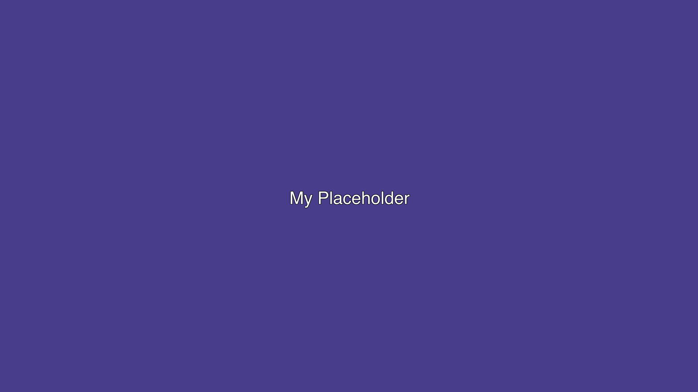](examples/basic-custom-text.png)

#### Gradients

```bash
# Simple gradient from red to blue
imagen generate -s 1024x768 -g red,blue
```

[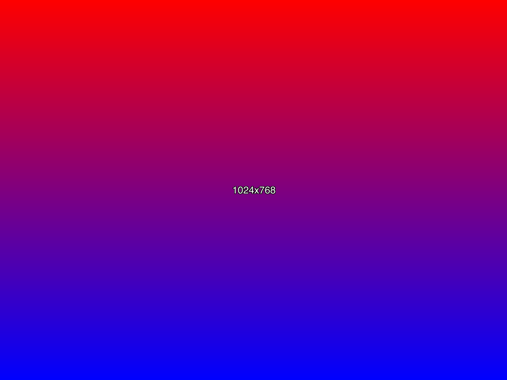](examples/gradient-simple.png)

```bash
# Gradient with angle
imagen generate -s 1024x768 -g ff0000,0000ff:45
```

[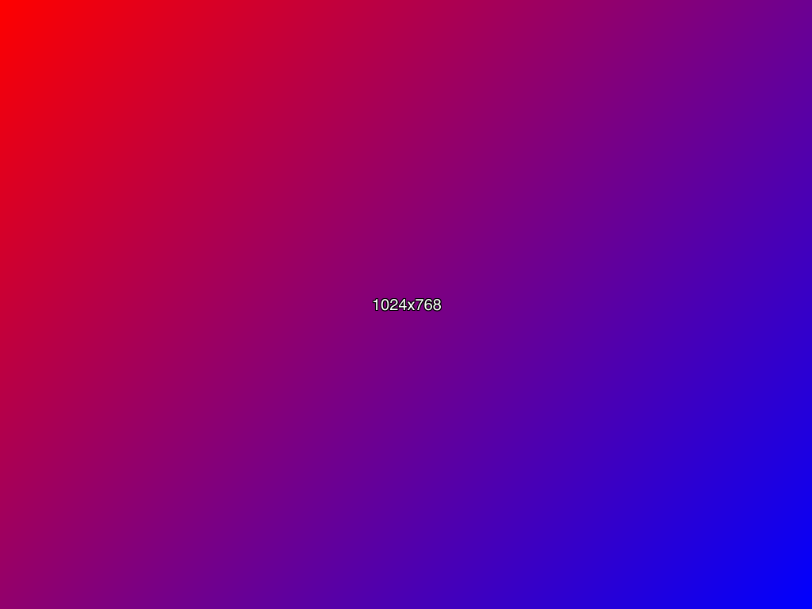](examples/gradient-angled.png)

```bash
# Multi-color gradient
imagen generate -s 800x600 -g red,yellow,green,blue:90
```

[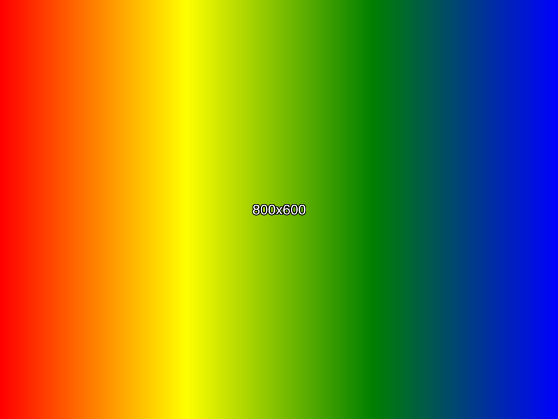](examples/gradient-multi.png)

#### Tiles and Patterns

```bash
# Checkered pattern with default tile size
imagen generate -s 800x600 -t black,white
```

[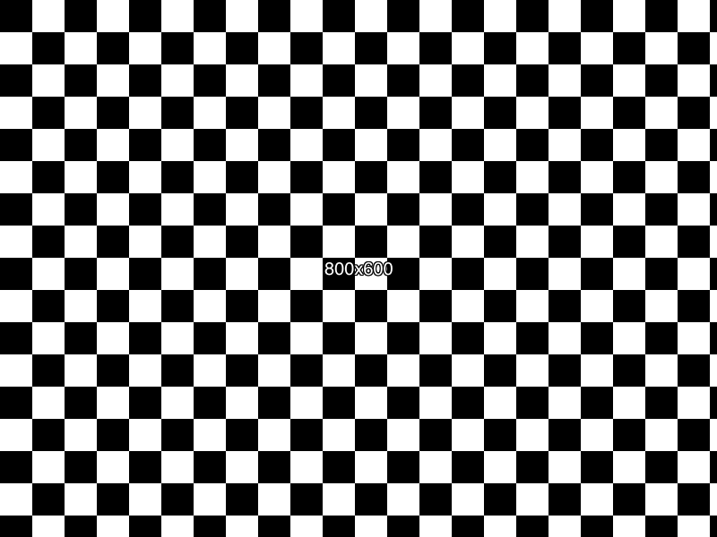](examples/tiles-checkered.png)

```bash
# Colored tiles with custom size
imagen generate -s 600x400 -t red,green,blue:50
```

[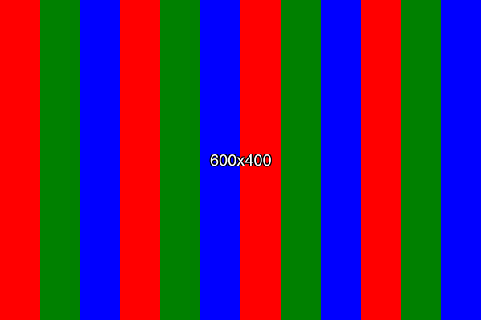](examples/tiles-colored.png)

```bash
# Random noise pattern
imagen generate -s 800x600 -n 336699,99ccff,ffffff:20
```

[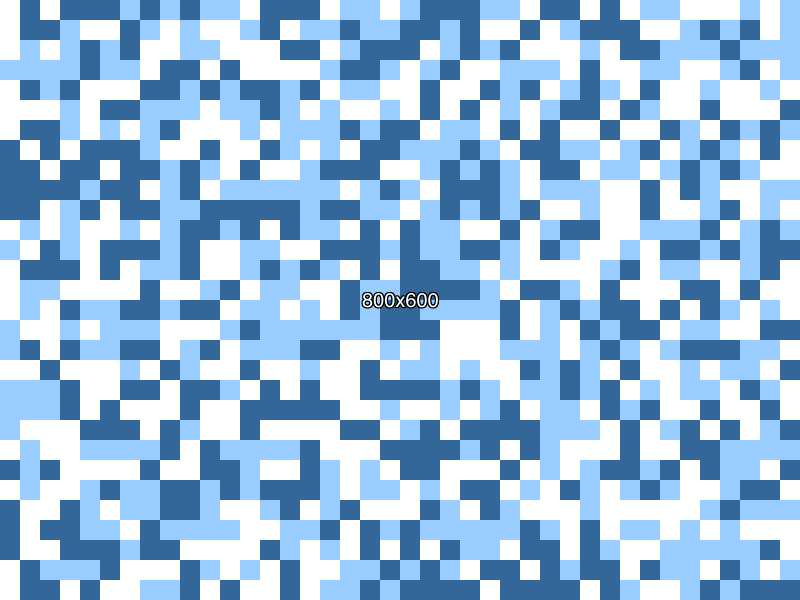](examples/noise-pattern.png)

#### Text customization

```bash
# Custom text color
imagen generate -s 500x300 -c navy --text "Hello World" --text-color yellow --text-size 36
```

[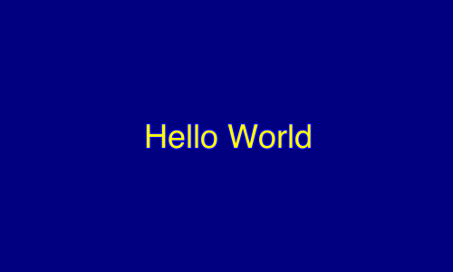](examples/text-colored.png)

```bash
# Rotated text
imagen generate -s 600x400 -c teal --text "Rotated!" --text-angle 45 --text-size 40
```

[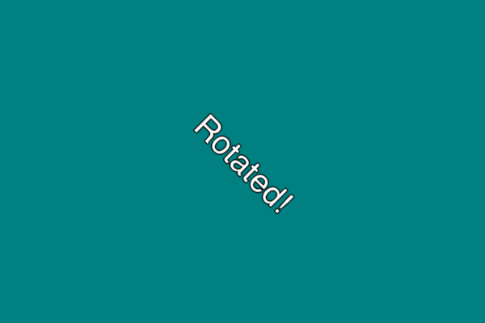](examples/text-rotated.png)

#### Borders

```bash
# Simple border
imagen generate -s 800x600 -c lightblue -b 10,navy
```

[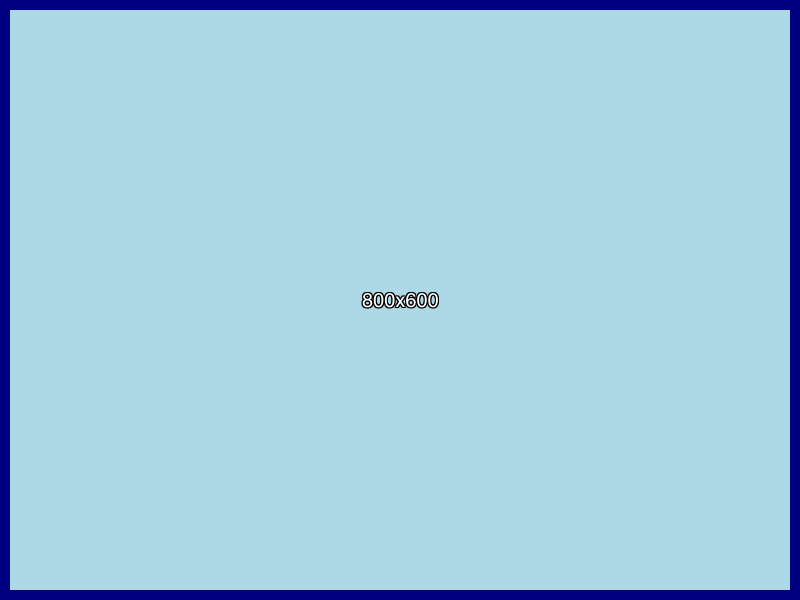](examples/border-simple.png)

```bash
# Border with gradient background
imagen generate -s 1024x768 -g skyblue,darkblue:90 -b 5,white
```

[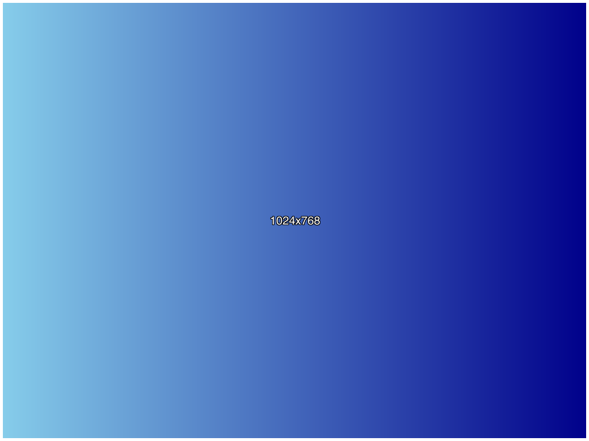](examples/border-gradient.png)

#### Multiple images and formats

```bash
# Generate multiple sizes
imagen generate -s 400x300 -s 800x600 -s 1920x1080 -c steelblue

# Multiple color variations
imagen generate -s 800x600 -c red -c green -c blue -f output.png

# JPEG output
imagen generate -s 1920x1080 -c coral --format jpeg -f banner.jpg
```

#### Random colors with multiple runs

The `--nr` (number of runs) parameter is especially useful when working with random colors. Each run regenerates random colors, allowing you to create multiple variations from the same configuration:

```bash
# Generate 5 variations: each with a random solid color and a random gradient
# This creates 10 images total (2 color definitions × 5 runs)
# Output: placeholder-0001.png through placeholder-0010.png
imagen generate \
  -s 800x600 \
  -c random \
  -g blue,random:45 \
  -r 5 \
  -f "placeholder-{nr}.png"

# Create a set of placeholders with random colors for different sizes
# Using {w}, {h}, and {nr} in the filename
# Output: thumb-300x200-0001.png, thumb-300x200-0002.png, ..., hero-1920x1080-0009.png
imagen generate \
  -s 300x200 \
  -s 800x600 \
  -s 1920x1080 \
  -c random \
  -r 3 \
  -f "thumb-{w}x{h}-{nr}.png"
```

Example output (2 runs shown):

<a href="examples/random-1-0001.png">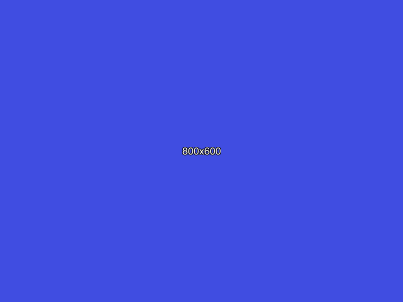</a>
<a href="examples/random-2-0002.png">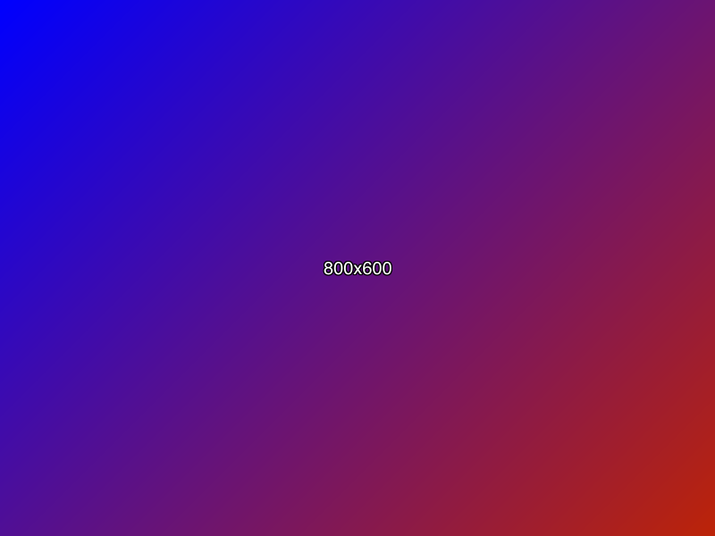</a>
<a href="examples/random-3-0003.png">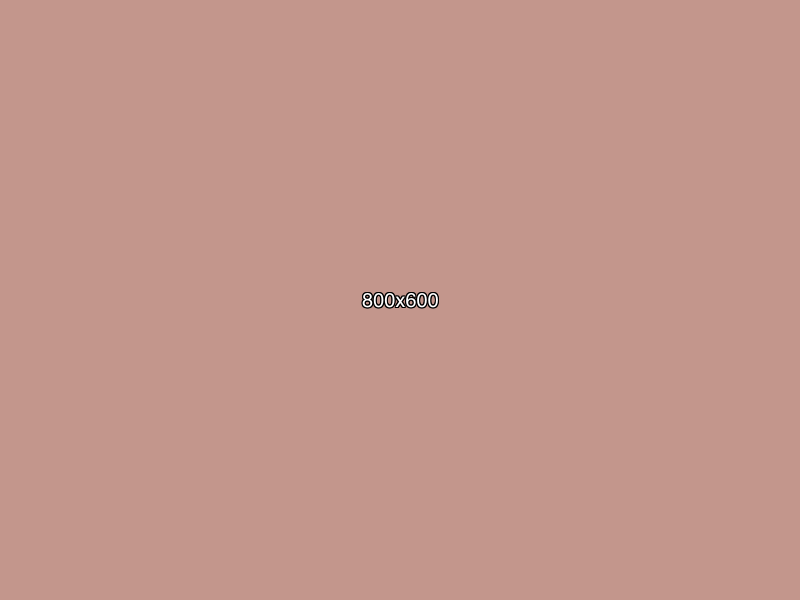</a>
<a href="examples/random-4-0004.png">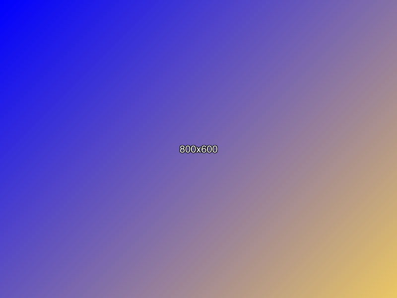</a>

#### Complex example

```bash
# Professional looking placeholder with all features
imagen generate \
  --size 1200x630 \
  --gradient "4A90E2,7B68EE:135" \
  --text "Coming Soon - {w}x{h}" \
  --text-size 48 \
  --text-color white \
  --border 8,2C3E50 \
  --filename social-media-placeholder.png
```

[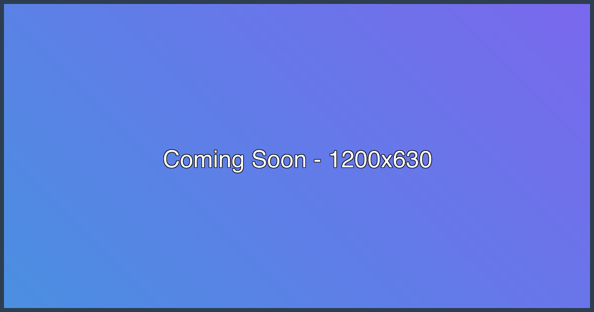](examples/complex-example.png)

### Web Server Examples

#### Starting the server

```bash
# Start on default port 3000
imagen serve

# Custom port
imagen serve --listen :8080

# Multiple addresses
imagen serve --listen :3000,192.168.1.100:8080
```

#### URL Examples

```bash
# Default image
http://localhost:3000/

# Basic size
http://localhost:3000/800x600

# Solid color background
http://localhost:3000/640x480/c:steelblue

# Gradient
http://localhost:3000/1024x768/g:ff6b6b,4ecdc4:45

# Tiles
http://localhost:3000/800x600/t:2c3e50,ecf0f1:40

# Noise pattern
http://localhost:3000/600x400/n:e74c3c,3498db,2ecc71:25

# Custom text
http://localhost:3000/1200x630/c:5f27cd/t:"Hello World",s:48,c:ffffff

# Rotated text
http://localhost:3000/800x600/c:222222/t:"Diagonal Text",s:36,c:00d2d3,a:45

# With border
http://localhost:3000/1920x1080/g:141e30,243b55/b:10,ff6348/t:"HD Placeholder",s:64,c:ffffff

# Random color selection (refreshes with different color each time)
http://localhost:3000/800x600/c:red/c:green/c:blue/t:random,blue

# Complex example
http://localhost:3000/1200x630/g:667eea,764ba2:135/t:"Social Media Banner {w}x{h}",s:42,c:ffffff/b:8,f8f9fa
```

#### Using in HTML

```html
<!-- Simple placeholder -->


<!-- Responsive placeholder -->


<!-- Profile picture placeholder -->

```

## Installation

### Prerequisites

- Go 1.18 or higher

### Build from source

```bash
# Clone the repository
git clone https://github.com/bylexus/imagen.git
cd imagen

# Build the binary
go build -o imagen ./cmd/imagen

# Optional: Install to your Go bin directory
go install ./cmd/imagen
```

The binary will be available as `imagen` (or `./imagen` if not installed to your PATH).

## Supported image configurations

by default, imagen just creates a sample 256x192 gray image with a white text on it (drawing the actual size). But imagen can produce individualized images. The following parameters are supported:

- image size (width, height)
- background colors:
  - solid color (e.g. 'blue', or '#0000FF')
  - random solid color
  - pixelated / tiled with multiple colors (e.g. black/white tiles)
  - color gradients with 2 or multiple colors and angles
- configurable text
  - text content
  - text color (default: white xor'ed with the background)
  - text size
  - text angle
- border: The image can also have a border:
  - border width
  - border color
- image output format: png, jpeg 

## Starting / using imagen

```
# cli mode:
imagen generate [parameters]

# web server mode:
imagen serve [parameters]

```

### generate parameters

`--size=[WxH]`, `-s [WxH]`: width/height. defaults to 256x192. Can be given multiple times to generate multiple images (see `--filename` below)

`--color=[single color]`, `-c [single color]`: The color parameter defines a single background color (solid color):

- `-c aliceblue`: single background color, html name aliceblue
- `-c ff0000`: single background color, red in hex code
- `-c random`: single background color, random color from the RGB spectrum

`--gradient=[color1],[color2]:[angle]`, `-g [color1],[color2]:[angle]`: gradient of two or more colors and an optional gradient angle:

- `-g red,0000ff`: Gradient background from red to blue (hex), top to bottom (angle 0)
- `-g 0000ff,random:45`: Gradient background from blue (hex) to a random color, 45 degrees tilted

`--tiles=[color1],[color2][...[color-n]]:[tile-size]`, `-t [color1],[color2][...[color-n]]:[tile-size]`: colored tiles with n colors. At least 2 colors must be defined, then colored tiles of the given size are created. Colors are applied in order.

- `-t red,green,blue`: Tiles alternating from red to green to blue, tile size 36px by default
- `-t red,ffffff:10`: Tiles alternating from red to white, tile size 10px

`--noise=[color1],[color2][...[color-n]]:[tile-size]`, `-n [color1],[color2][...[color-n]]:[tile-size]`: like colored tiles with n colors, but colors are applied randomly (like noise, so the 'n' stands for noise). At least 2 colors must be defined, then colored tiles of the given size are created. Colors are applied randomly.

- `-n red,green,blue`: Tiles randomly colored from red to green to blue, tile size 36px by default
- `-n red,ffffff:10`: Tiles randomly colored from red to white, tile size 10px

In addition, all color parameter forms also take an optional text color information with `:t:[color]`, to set the text color. Examples:

- `-c aliceblue:t:red` creates a single-colored aliceblue background with red font color
- `-g 0000ff,random:45:t:red`: Gradient background from blue (hex) to a random color, 45 degrees tilted, with red text color
- `-t red,ffffff:10:t:blue`: Tiles alternating from red to white, tile size 10px, with red text
- `-n red,ffffff:10:t:blue`: Noise Tiles from red to white, tile size 10px, with red text

You can provide multiple color parameters, from different and the same types. If multiple color parameters are given, the CLI generates an image for each color parameter. Example:

`imagen -c blue -c random -g blue,ff0000` will generate 3 images: one with a blue background, one with a random color background, and one with a gradient of blue to red.


`--border=[width],[color]` `-b [width],[color]`: The border width in pixels and color

`--text=[text]`: The text to output. You can use `{w}` and `{h}` as placeholder for the generated size.

`--text-size=[size]`: The text size in pt

`--text-color=[color]`: The text color (e.g. `white` or `ffffff`). Note: if a text color is specified in a color parameter (e.g. `-c blue:t:red`), that takes precedence over this default text color.

`--text-angle=[angle]`: The text angle in degrees (e.g. `45` for 45-degree rotation)

`--format=[format]`: The output format. Supported formats are `png` and `jpeg` (default: `png`)

`--nr=[nr]`, `-r [nr]`: Number of runs: a "Run" may create one or more images, according to the color parameters above:
This is useful if you have random colors, and want to generate multiple images from the same color definitions. The image number can be used in the filename template: the `{nr}` placeholder will be replaced with the actual image number.

Example:

`imagen -c random -g blue,random -r 3` will create 6 images (2 different colors with 3 "runs"), while the random generated colors are different each time.

`--filename=[filename]`, `-f filename`: Output filename. You can use `{w}`, `{h}`, `{nr}` in the filename as placeholders for width, height, and image number

### serve parameters

the `serve` command starts a web server on port 3000 by default. You can configure its behaviour with the following parameters:

`--listen=[listen address]`: tcp ip/port to listen, e.g. `:3000` to list on all IPs on port 3000, or `192.168.1.20:5555` for a specific IPv4, `[::1]:4567` for an IPv6. Multiple listener addresses can be separated by comma.

## URL scheme

All the above options can be defined as URL parameters. The standard image can just be produced with

```
# produces the standard image:
http://[imagen-url]/
```

All parameters can be defined in the URL. The first parameter is always the size of the image,
while the following parameters can be placed in any order: They are separated by a slash (`/`), and prefixed with a single
character to indicate the parameter type:

```
http://[imagen-url]/[size]/[c|g|t|n]:[color-config]:[text-color]/t:[text]/f:[format]/b:[border]
```

#### size

The first parameter is the size of the image. It is a pair of width x height number:

```
http://[imagen-url]/320x200
```

#### background definition

A background definition begins with a single char, which defines the mode, then a color definition. The URL knows the following color modes:

- `c:[color]`: single color background, e.g. `c:blue` creates a blue background. Some examples:
	- `c:aliceblue`: single background color, html name aliceblue
	- `c:ff0000`: single background color, red in hex code
	- `c:random`: single background color, random color from the RGB spectrum
- `g:[color1],[color2]:[angle]`: gradient of two or more colors and a gradient angle:
  - `g:red,0000ff`: Gradient background from red to blue (hex), top to bottom (angle 0)
  - `g:0000ff,random:45`: Gradient background from blue (hex) to a random color, 45 degrees tilted
- `t:[color1],[color2][...[color-n]]:[tile-size]`: colored tiles with n colors. At least 2 colors must be defined, then colored tiles of the given size are created. Colors are applied in order.
  - `t:red,green,blue`: Tiles alternating from red to green to blue, tile size 36px by default
  - `t:red,ffffff:10`: Tiles alternating from red to white, tile size 10px
- `n:[color1],[color2][...[color-n]]:[tile-size]`: like colored tiles with n colors, but colors are applied randomly (like noise, so the 'n' stands for noise). At least 2 colors must be defined, then colored tiles of the given size are created. Colors are applied randomly.
  - `n:red,green,blue`: Tiles randomly colored from red to green to blue, tile size 36px by default
  - `n:red,ffffff:10`: Tiles randomly colored from red to white, tile size 10px

In addition, all parameter forms also take an optional text color information with `:t:[color]`, to set the text color. Examples:

- `c:aliceblue:t:red` creates a single-colored aliceblue background with red font color
- `g:0000ff,random:45:t:red`: Gradient background from blue (hex) to a random color, 45 degrees tilted, with red text color
- `t:red,ffffff:10:t:blue`: Tiles alternating from red to white, tile size 10px, with red text
- `n:red,ffffff:10:t:blue`: Noise Tiles from red to white, tile size 10px, with red text

Color parameters can be defined multiple times: If multiple color parameters are given in the URL,
each requested image choses one color definition randomly.

**Example:**

```
http://[imagen-url]/400x300/c:blue/g:red,green/t:ff0000,aliceblue
```

This URL generates randomly either:

- a blue solid background
- a gradient from red to green
- tiles with red and aliceblue colors


#### Text

The text parameter starts with `t:`, followed by a (quoted) text, then optional size, color, and angle definitions:

`t:"Text to output",s:26,c:yellow,a:45`

The optional parameters are:
- `s:[size]` - text size in pt (defaults to 12pt)
- `c:[color]` - text color (defaults to white)
- `a:[angle]` - text angle in degrees (defaults to 0)

The text supports the placeholders `{w}` and `{h}`, which are replaced with the image's width and height values:

`t:"Image: {w}x{h}",s:26,c:yellow,a:45`

#### Border

The `b:size,color`  parameter defines a border around the image, e.g.

`b:5,ff0000` creates a 5 pixel red border.

#### Output format

The `f:[format]` parameters defines the image output format. Supported formats are:

- jpg, jpeg
- png

#### Examples

- Default image: 256x192, black background, white text stating "256x192":
  `http://[imagen-url]/`
- Image size: 500x300, black background, white text stating "500x300":
  `http://[imagen-url]/500x300`
- Image size: 500x300, red background with blue text:
  `http://[imagen-url]/500x300/c:red:t:blue`
- Image size: 500x300, red to blue gradient, white text
  `http://[imagen-url]/500x300/g:red,blue:t:white`
- Image size: 500x300, red to blue gradient, angled 120 degrees, white text
  `http://[imagen-url]/500x300/g:red,blue:120:t:white`
- Image size: 500x300, either a solid green color or tiles of blue/white, 10px wide, and a black 10px border. A white text, 30pt, states "Hello, World 500x300". The color mode is chosen randomly:
  `http://[imagen-url]/500x300/c:00ff00/t:white,blue:10/b:10,black/t:"Hello, World {w}x{h}",s:30,c:white`


## Supported color values

the following color values are supported:

- RGB hex form, e.g. `ff33a6`, with red = `ff`, green = `33` and blue = `a6`
- supported HTML color names like `blue`, `darkbrown`, `aliceblue`, as defined by the W3C (<https://www.w3schools.com/colors/colors_names.asp>)
- the special value `random`, which just returns a random color from the RGB spectrum


## Software Architecture

The program consists of three main modules:

- the image generator module includes all logic to generate images
- the web server module manages the web server and parses the parameters from the url. It uses the generator module to create the images.
- the cli module offers the cli interface and parses the parameters from the command line. It uses the generator module to create the images.

